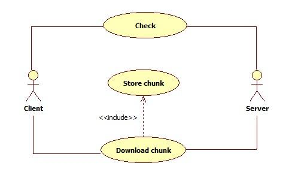
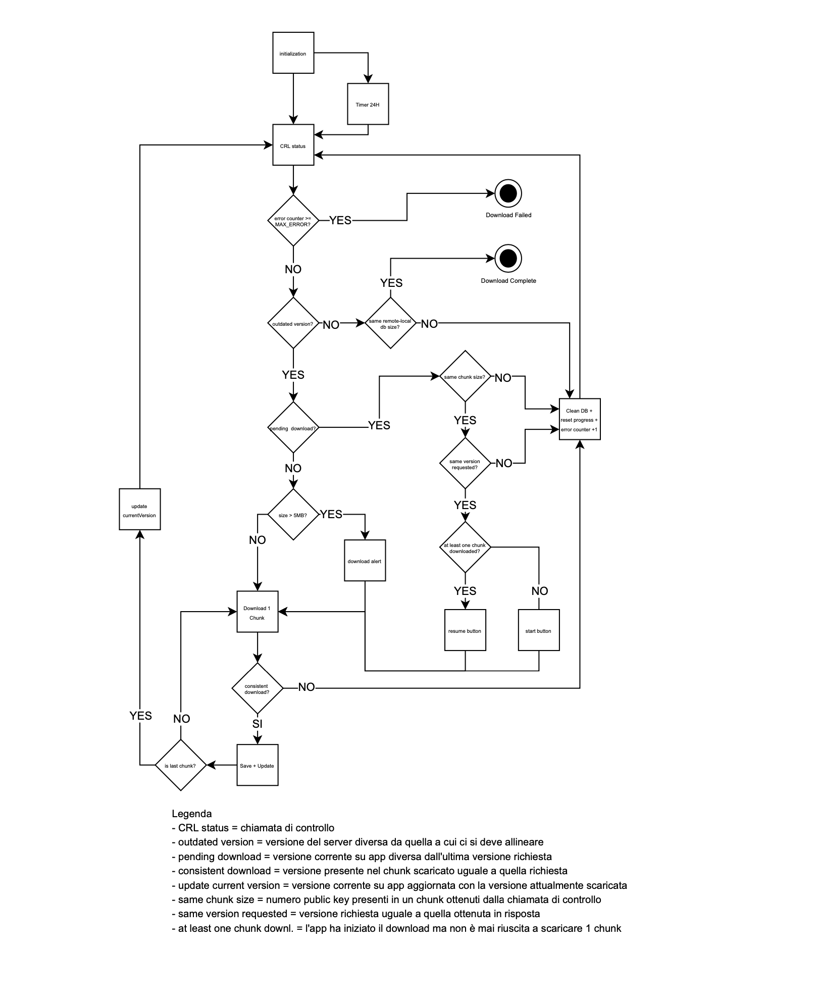

# DGC Revocation List

**Indice**

- [Scopo del documento](#scopo-del-documento)
  - [Acronimi](#acronimi)
  - [Definizioni](#definizioni)
  - [Panoramica](#panoramica)
  - [Casi d'Uso](#casi-duso)
- [Scenari di Integrazione](#scenari-di-integrazione)
  - [Flusso Applicativo](#flusso-applicativo)
- [Documentazione](#documentazione)
  - [Check](#check)
  - [Download](#download)
  - [Example](#example)

## Scopo del documento

Il presente documento si prefigge lo scopo di dettagliare il processo di
gestione delle revoche dei Green Pass, in maniera tale da consentire a
terzi l'adeguamento delle SDK finalizzato alla gestione delle revoche.

## Acronimi

| Acronimo            | Descrizione                              |
| --------------- | ---------------------------------------- |
| SDK           | Software Development Kit                     |
| DGC       | Digital Green Certificate (in Italia conosciuto col nome di GreenPass).  | 
| DRL   | DGC Revocation List           | 
| UVCI      | Unique Vaccination Certificate Identifier            | 
| SHA-256 | Secure Hash Algorithm a 256 bit |

## Definizioni

| Definizione            | Descrizione                              |
| --------------- | ---------------------------------------- |
| SNAPSHOT           | Rappresenta la lista completa di tutti gli identificativi dei DGC revocati in un dato momento rappresentato da una versione                     |
| DIFF       | Rappresenta la lista delle operazioni (ADD/REMOVE) che devono essere eseguite su di una data SNAPSHOT per ottenerne una più aggiornata.               | 
| ADD   | Rappresenta l'operazione di aggiunta di un DGC all'interno della lista dei revocati ed è uno degli elementi base di una DIFF.          | 
| REMOVE      | Rappresenta l'operazione di rimozione di un DGC all'interno della lista dei revocati ed è uno degli elementi base di una DIFF.            | 
| CHUNK | Le DIFF e le SNAPSHOT vengono partizionati in elementi dalle dimensioni ridotte per facilitarne il trasporto, tali elementi prendono il nome di CHUNK. |
| DIGEST | Termine utilizzato per identificare un elemento del codominio di una funzione di hash. |
| BASE64 | Sistema di codifica basato sulla traduzione di dati binari in stringhe di testo ASCII (gruppi di 6 bit vengono rappresentati attraverso un carattere selezionato tra 64 caratteri ASCII diversi). |

##  Panoramica

Nel rispetto delle indicazioni fornite dagli Organi competenti, un DGC
prodotto dalla Piattaforma Nazionale può essere revocato; la revoca di
un DGC comporta la sua mancata verifica da parte degli SDK che
implementano i casi d'uso legati alla gestione delle DRL (la Piattaforma
Nazionale prevede anche l'annullamento di una revoca per modellare
casistiche residuali).

Per mantenere inalterato il vincolo della verifica offline dei DGC da
parte delle SDK, è necessario introdurre un meccanismo in grado di
trasferire ad intervalli regolari il contenuto informativo necessario
alla generazione di una DRL dalla Piattaforma Nazionale ai dispositivi
Client.

L'insieme di tutti i DGC revocati in un dato istante è indentificata con
il nome di SNAPSHOT; questi artefatti sono generati ad intervalli
regolari e sono caratterizzati da una versione e da un insieme di
identificativi univoci di DGC.

Per minimizzare il quantitativo di informazioni da trasferire è stato
introdotto il concetto di DIFF: una DIFF rappresenta l'insieme di
operazioni di ADD e REMOVE che devono essere eseguita su di una SNAPSHOT
di partenza per ottenere una SNAPSHOT di arrivo.

Malgrado l'ottimizzazione introdotta dall'utilizzo delle DIFF, non si
può escludere la possibilità che un Client sia obbligato a recupere un
ingente quantitativo di dati; per semplificare le operazioni di
trasferimento è previsto che le entità, siano esse SNAPSHOT o DIFF,
vengano trasferite sottoforma di CHUNK, ovvero di partizioni, dalla
dimensione massima configurata a livello della Piattaforma Nazionale.

Ciascun DGC sarà identificato in maniera univoca dal digest del suo UVCI
calcolato attraverso la funzione di hash SHA-256 e codificato in Base64.
Sapendo che:

- la funzione SHA-256 produce word di dimensione pari a 256 bit (a
    prescindere dalla dimensione dell'input);

- un digit Base64 esprime 6 bit (cioè 64 diverse configurazioni);

- una word Base64 deve essere composto da un numero di digit multiplo
    di 4 (in caso di necessità si dovrà ricorrere al padding tramite
    "=");

è possibile affermare che un identificativo di un DGC all'interno di una
DRL sarà composto da 44 caratteri (dato che 256/6 ≈ 42,66 avremo 43
digit informativi ed un digit "=" di padding).

```js
const crypto = require('crypto');

const transformedUVCI = crypto.createHash('sha256').update("Hello!").digest('base64');
```

```
M00Bb3Vc1txYxTqG4YOIL47BT1L7BTRYh8il7dQsh7c=
```

Da un punto di vista implementativo l'introduzione delle DRL comporta
l'evoluzione dello strato di persistenza delle SDK in maniera tale da
prevedere una struttura atta alla memorizzazione di un numero
potenzialmente molto elevato di identificativi; malgrado non sia in
alcun modo vincolante, per garantire performance in linea con le
aspettative si consiglia di preferire database non relazionali con
supporto per operazioni bulk (questo consentirà prestazioni elevate sia
in fase di verifica di un DGC, sia in fase di aggiornamento della DRL).

Si consiglia infine di implementare alcuni accorgimenti:

1.  la verifica della DRL dovrebbe essere implementata come uno step
    opzionale del processo, in maniera tale che il suo stato possa
    essere guidato da un apposito configuration item propagato tramite
    la Piattaforma Nazionale;

2.  il mancato aggiornamento della DRL implica una visione
    potenzialmente non corretta e non completa dell'insieme dei DGC
    prodotti dalla Piattaforma Nazionale, per tanto dovrebbero essere
    previsti dei controlli sullo stato di aggiornamento della DRL in
    grado di inibire la scansione dei DGC;

3.  per ottimizzare il traffico di rete le DRL non vengono trasferite
    sottoforma di SNAPSHOT complete, ma tipicamente sono rappresentate
    da DIFF partizionate in CHUNK; questo comporta la necessità di
    eseguire dei controlli di congruenza per assicurare che l'esito
    della costruzione dell nuova DRL abbia avuto l'esito sperato (in
    caso contrario si consiglia di eseguire il download completo
    dell'ultima SNAPSHOT disponibile).

## Casi d'Uso

Ad un elevato livello di astrazione la comunicazione tra Client e Server
può essere così sintetizzata:

1.  Il Client esegue una chiamata ispettiva per valutare la dimensione
    dei dati da trasferire al fine di allineare la DRL interna al
    dispositivo all'ultima disponibile sulla Piattaforma;

2.  Il Client decide di proseguire nel trasferimento e recupera un chunk
    contenente una partizione degli identificativi dei DGC necessari
    all'allineamento;

3.  Il Client memorizza gli identificativi contenuti nel chunk sul
    proprio strato di persistenza;

4.  Il Client prosegue nel recupero e nella memorizzazione dei chunk,
    sino a che non termina il trasferimento; a trasferimento avvenuto
    una ulteriore chiamata ispettiva consentirà di effettuare dei
    controlli di quadratura tra il proprio stato interno e quello della
    Piattaforma (in caso di mancata corrispondenza si consiglia di
    riavviare il procedimento richiedendo il trasferimento dei chunk
    dell'ultima SNAPSHOT disponibile, facendo attenzione a non innescare
    cicli indefiniti).



Nei paragrafi seguenti saranno forniti maggiori dettagli riguardo una
possibile implementazione degli scenari di integrazione assieme alla
documentazione delle API esposte dalla Piattaforma per la gestione delle
DRL.

# Scenari di Integrazione

Viene di seguito descritta l’integrazione e la gestione della DRL all’interno della app VerificaC19. Nell’integrazione di questo processo in ambito applicativo potremo osservare vari comportamenti e casi limite da gestire. 

## Flusso Applicativo

Nella descrizione del flusso applicativo faremo riferimento al seguente diagramma di flusso:



# Documentazione

In questo paragrafo verranno documentate le due API REST esposte per la
gestione delle DRL.

## Check

https://get.dgc.gov.it/v1/dgc/drl/check

Lo scopo di questa API è quello di eseguire una chiamata ispettiva: il
Client fornisce al Server la versione della DRL che attualmente possiede
ed il Server risponde fornendo i metadati necessari ad allineare tale
DRL all'ultima disponibile sul Server. Ciascun Client dovrebbe invocare
tale endpoint prima di avviare le operazioni di acquisizione, per
pianificare le attività da eseguire, e dopo l'acquisizione per eseguire
dei controlli di quadratura. Nello specifico il Server potrebbe
rispondere con i metadati relativi al recupero di una intera SNAPSHOT
(in caso di prima installazione o qualora la politica di retention delle
SNAPSHOT ha fatto sì che la versione in possesso del Client non sia più
disponibile nella Piattaforma) o di una DIFF (in questo caso il Client
verrà istruito su come colmare il gap tra la versione che possiede e
l'ultima disponibile); il Server ovviamente darà precedenza alle DIFF
per ottimizzare il traffico di rete.

### Request

| Method           | URL |
| -------------- | ------ |
| GET | /v1/dgc/drl/check|

Parametri

| Type           | Params | Values | Required |
| -------------- | ------ | ---- | ----- |
| REQUEST PARAM | version | long | false |
| REQUEST PARAM | chunk | long | false |

**version**

Versione della DRL che attualmente è in possesso del Client. Tale campo
è essenziale per consentire al Server di comprendere quale DRL deve
essere presa in esame, ma risulta essere non obbligatorio in quanto alla
prima invocazione il Client non sarà in possesso di una DRL (in caso di
assenza della versione il Server indurrà il Client ad eseguire il
download dell'ultima SNAPSHOT disponibile). Il valore fornito dal Client
dovrà essere non negativo ed inferiore all'ultima versione disponibile
all'interno della Piattaforma.

**chunk**

Ultimo chunk della DRL scaricato dal Client. Anche tale campo è
essenziale per comprendere lo stato di avanzamento dell'allineamento tra
Client e Server, è reso non obbligatorio in quanto la sua assenza è
interpretata al pari della richiesta del primo chunk (un valore maggiore
di 1 per questo parametro influenzerà alcuni dei metadati forniti dal
server che indicano la percentuale di avanzamento nel processo di
allineamento della DRL locale del Client rispetto l'ultima disponibile
sul Server). Il valore fornito dal Client dovrà essere non negativo.

### Response

| Type           | Status code |
| -------------- | ------ |
| application/json  | 200 Metadati DRL recuperate con sucesso.<br>400 I parametri forniti non consentono il recupero di una DRL<br>500 Errore interno.|

| Field           | Type | Description |
| -------------- | ------ | ---- |
| id | String | Identificativo univoco della SNAPSHOT o della DIFF restituiti. |
| creationDate | Date | Valorizzata solo se i metadati restituiti fanno riferimento ad una SNAPSHOT, rappresenta la sua data di creazione. |
| fromVersion | Long | Questo campo conterrà la versione che il Client ha comunicato possedere (campo `version` della request) |
| version | Long | Questo campo conterrà l’ultima versione disponibile nella Piattaforma. |
| chunk | Integer | Questo campo conterrà il chunk che il Client ha comunicato possedere (campo `chunk` della request). |
| lastChunk | Integer | Ultimo chunk disponibile per la versione in esame. |
| firstElementInChunk | String | Primo identificativo contenuto nel chunk. |
| lastElementInChunk | String | Ultimo identificativo contenuto nel chunk. |
| numDiAdd | Integer | In caso di DIFF conterrà il numero di ADD della DIFF, altrimenti conterrà il numero totale di identificativi della SNAPSHOT (lato Client il trasferimento di una nuova SNAPSHOT coinciderà con l’eliminazione della vecchia e l’ADD di tutti gli elementi che compongono la nuova). |
| numDiDelete | Integer | In caso di DIFF conterrà il numero di REMOVE della DIFF (funzionalmente una REMOVE coincide con l’annullamento di una revoca).|
| totalNumberUCVI | Integer | Numero totale di identificativi che compongono l’entità di interesse (SNAPSHOT o DIFF a seconda dei casi). |
| totalChunk | Integer | Numero totale di chunk che compongono l’entità di interesse (SNAPSHOT o DIFF a seconda dei casi). |
| sizeSingleChunkInByte | Long | Dimensione di un singolo chunk espressa in byte. |
| totalSizeInByte | Long | Byte che ancora restano da scaricare. Calcolato conoscendo la dimensione del singolo chunk, il numero totale di chunk, ed il numero di chunk attualmente scaricati (indicato dal campo chunk della request). |

## Download

https://get.dgc.gov.it/v1/dgc/drl

Lo scopo di questa API è quello di recuperare le operazioni da eseguire
sugli identificativi dei DGC revocati per allineare la DRL interna del
Client all'ultima versione disponibile sul Server. Come accennato in
precedenza il Server potrà restituire tutte le ADD necessarie a
costruire una nuova SNAPSHOT, oppure le ADD e le REMOVE necessarie a
trasformare una versione obsoleta di una DRL nell'ultima versione
disponibile. Per evitare di trasferire tutto il contenuto in un'unica
soluzione si utilizzerà il parametro chunk per selezionare quale
partizione recuperare.

### Request

| Method           | URL |
| -------------- | ------ |
| GET | /v1/dgc/drl |

Parametri

| Type           | Params | Values | Required |
| -------------- | ------ | ---- | ----- |
| REQUEST PARAM | version | long | false |
| REQUEST PARAM | chunk | long | false |

**version**

Vedi API check.

**chunk**

Vedi API check.

### Response

| Type           | Status code |
| -------------- | ------ |
| application/json  | 200 Metadati DRL recuperate con sucesso.<br>400 I parametri forniti non consentono il recupero di una DRL<br>500 Errore interno.|

| Field           | Type | Description |
| -------------- | ------ | ---- |
| id | String | Vedi API check. |
| creationDate | Date | Vedi API check. |
| fromVersion | Long | Vedi API check. |
| version | Long | Vedi API check. |
| chunk | Integer | Vedi API check. |
| lastChunk | Integer | Vedi API check. |
| firstElementInChunk | String | Vedi API check. |
| lastElementInChunk | String | Vedi API check. |
| numDiAdd | Integer | Vedi API check. |
| numDiDelete | Integer | Vedi API check. |
| totalNumberUCVI | Integer | Vedi API check. |
| totalChunk | Integer | Vedi API check. |
| sizeSingleChunkInByte | Long | Vedi API check. |
| totalSizeInByte | Long | Vedi API check. |
| revokedUcvi | String[] | Lista degli identificativi contenuti nel chunk identificato dal parametro `chunk`, per la SNAPSHOT con versione identificata dal parametro `version` (questo attributo non sarà valorizzato nel caso in cui si stia eseguendo il download di un chunk di una DIFF). |
| delta | Object | Oggetto contenete due liste, insertions e deletions, che a loro volta contengono rispettivamente la lista degli identificativi da inserire e da cancellare per allineare la versione della DRL posseduta dal Client a l’ultima disponibile sul Server. Anche in questo caso le operazioni da eseguire saranno organizzate in chunk (questo attributo non sarà valorizzato nel caso in cui si stia eseguendo il download di un chunk di una SNAPSHOT). |

## Esempio

A scopo esemplificativo supponiamo che un Client privo di una propria
DRL esegua una chiamata ispettiva (non fornendo alcun parametro di input
dato che non possiede alcun dato da comunicare al Server):

[https://get.dgc.gov.it/v1/dgc/drl](https://get.dgc.gov.it/v1/dgc/drl)

Il Server risponderà fornendo le istruzioni per recuperare l'ultima
SNAPSHOT disponibile, supponiamo la 3, composta da 40 identificativi di
DGC revocati, organizzati in 4 chunk da 10 elementi:

```json
{
    "id": "61bcc7c3da0f876422c6a67f",
    "version": 3,
    "chunk": 1,
    "numDiAdd": 40,
    "totalsizeInByte": 2040,
    "sizeSingleChunkInByte": 510,
    "totalChunk": 4,
    "totalNumberUCVI": 40
}
```

Sulla base di queste informazioni il Client si prepara a recuperare i 4
chunk della SNAPSHOT con versione 3, attraverso request simili alla
seguente, in cui il numero di chunk varierà tra 1 e 4:

[https://get.dgc.gov.it/v1/dgc/drl?chunk=1](https://get.dgc.gov.it/v1/dgc/drl?chunk=1)

A queste request il Server risponderà con 4 response simili alla
seguente fornendo i chunk che compongono la SNAPSHOT versione 3:

```json
{
    "id": "61bcc7c3da0f876422c6a67f",
    "version": 3,
    "chunk": 1,
    "lastChunk": 4,
    "revokedUcvi": [
        "Y31HekM4kgW3RiYs7/q9Uhck22fJfxG2VsIRgX21x9y=",
        "gOtUzHmEhta7qI6mCiDPkEpfxRIe2cMj29tgZGEocqy=",
        "cm400voloIOD8xW+ozFPo0g/f08f6SjfywJWsCbFNtg=",
        "rM162PJL9HruiQFu6nG1FOY/xxVHmuAYygDisJ6sC3g=",
        "9ak93pLUK/ESJRtk2NETFcES2+MhSqd5KcH6mJIBGTO=",
        "63KkohTEk+sYOjbOacS9m02IiNGgkjnmQaKpuh/gZMO=",
        "22IpoBG24VRVped+twMyfrB+3Ixnlu0aOmRP9E+g9nQ=",
        "K6WE8nmkwhNWnZbOudUdK2XICQmz023cbebwezyIu0Q=",
        "X28KgOG44t/6YaIUOjKDd45B99pbo9qtHeztXZynyEY=",
        "zjLEXusFYgo9DutFWsEaGuCL9RL8poPk2MkOyOM2nOs="
    ],
    "creationDate":"2021-12-17717:24:19.120+00:00",
    "firstElementInChunk":"Y31HekM4kgW3RiYs7/q9Uhck22fJfxG2VsIRgX21x9y=",
    "lastElementInChunk":"zjLEXusFYgo9DutFWsEaGuCL9RL8poPk2MkOyOM2nOs=",
    "sizeSingleChunkInByte": 510,
    "totalNumberUCVI": 40
}
```

A download terminato il Client dovebbe nuovamente eseguire una chiamata
ispettiva per verificare il numero totale di identificativi presenti
nella versione 3 (che sappiamo essere 40 dalla prima invocazione, ma che
richiediamo nuovamente per gestire casistiche residuali in cui il
download venga eseguito a cavallo della generazione sulla Piattaforma di
una nuova SNAPSHOT) per confrontarla con il numero di identificativi
presenti nella DRL che ha salvato all'interno del proprio strato di
persistenza.

Supponiamo ora che un secondo Client abbia invece internamente una
propria DRL, e che questa sia la versione 1; la sua chiamata ispettiva
sarà del tipo:

[https://get.dgc.gov.it/v1/dgc/drl/check?version=1](https://get.dgc.gov.it/v1/dgc/drl/check?version=1)

Il server risponderà a questa richiesta fornendo le informazioni
necessarie ad aggiornare la DRL versione 1, per renderla equivalente
alla DRL versione 3:

```json
{
    "id": "61bcc7c3da0£876422c6a6a8",
    "fromVersion": 1,
    "version": 3,
    "chunk": 1,
    "numDiAdd": 40,
    "totalsizeInByte": 2040,
    "sizeSingleChunkInByte": 510,
    "totalChunk": 4,
    "totalNumberUCVI": 40
}
```

Con questa response il Server comunica al Client che la versione 3 è
composta da 40 identificativi, e per passare dalla versione 1 alla
versione 3 è necessario aggiungerne 20, organizzati in 2 chunk (dato che
il numero totale di identificativi nella versione 3 è 40, e dato che per
passare dalla versione 1 alla 3 è necessario aggiungere 20
identificativi, questo ci permette di affermare che la versione 1
contiene 20 identificativi e che questi sono parte integrante della
versione 3; proprio per questo il Server sta istruendo il Client a non
eseguire il download completo della SNAPSHOT, ma piuttosto a recuperare
la DIFF che gli consentirà di ricostruire la DRL versione 3 a partire
dalla DRL versione 1).

A questo punto il Client si prepara ad eseguire delle richieste simile
alla seguente con un chunk che varia tra 1 e 2:

[https://get.dgc.gov.it/v1/dgc/drl/check?version=1&chunk=1](https://get.dgc.gov.it/v1/dgc/drl/check?version=1&chunk=1)

Il Server risponderà a queste request con delle response contenenti le
informazioni necessarie ad aggiornare la DRL versione 1 per renderla
equivalente alla versione 3:

```json
{
    "id": "61bcc7c3da0f876422c6a6a8",
    "fromVersion": 1,
    "version": 3,
    "chunk": 1,
    "lastChunk": 2,
    "delta": {
        "insertions": [
            "/56vInsThTXNJ9x2GrAXaDaVc7HA0j08FayveKey7KA=",
            "/sQVKUBUxDmT21FRm6vnPOA5rheTEYOBRIaP22gEXJO=",
            "63tnu42yVyNCpTjAIq2NsabINN5B19721c10RdYmDjk=",
            "AOXGyNOJID212fTePArNVFnqW4k23YGjkny405FqwEk=",
            "Et/XFDeE+v2z/hIL7dec0071e14XeT1YPPdwefavOvA=",
            "PVezXeW/CuesjOSE9gA4DGmtceOMJHp/VUb7V78tP7c=",
            "RCTq02Ynu4jGkPEVkjgWrgvINxflivul+sUPSwqMpuo="
        ],
        "deletions": []
    },
    "sizeSingleChunkInByte": 510,
    "totalNumberUCVI": 40
}
```

Nuovamente a download terminato il Client dovebbe eseguire una chiamata
ispettiva per verificare il numero totale di identificativi presenti
nella versione 3; come accennato in precedenza la versione 1 conteneva
20 identificativi ed a questi, a download terminato, ne avremo aggiunti
ulteriori 20 e quindi la DRL contenuta nello strato di persistenza del
Client dovrà contenere un totale di 40 identificativi, valore
coincidente con il numero totale di identificativi che compongono la
SNAPSHOT versione 3.
