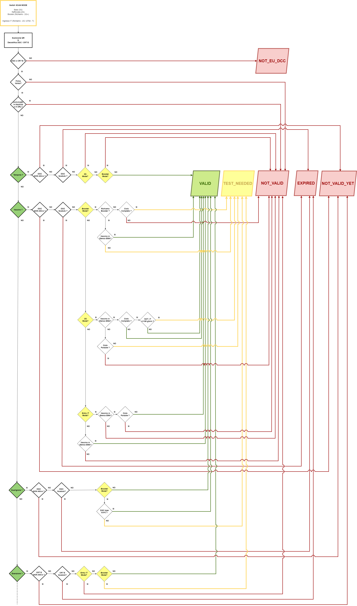

# ScanMode - Tipologie di verifica DGC

# Indice

- [Introduzione](#introduzione)
  - [Scopo del documento](#scopo-del-documento)
  - [Glossario](#glossario)
  - [Panoramica](#panoramica)
- [Scenari di Validazione](#scenari-di-validazione)
  - [Flusso Applicativo](#flusso-applicativo)
  - [Flussi Esenzione](#flussi-esenzione)
  - [Flussi Tampone](#flussi-tampone)
  - [Flussi Guarigione](#flussi-guarigione)
  - [Flussi Vaccinazione](#flussi-vaccinazione)
  - [Caso Limite](#caso-limite)  
- [Risorse SDK VerificaC19](#risorse-sdk-verificac19)
- [Note](#note)

# Introduzione

## Scopo del documento

Il presente documento si prefigge lo scopo di dettagliare i processi correlati alle tipologie di verifica Green Pass in Italia, onde agevolare gli sviluppatori terzi nell'adeguamento di librerie / applicazioni software per la gestione delle validazioni [[1]](#1).

Nelle sezioni successive sono pertanto riportati i tracciati dei flussi di validazione attualmente previsti, mostrando le logiche dei relativi controlli attraverso esempi di pseudocodice - basato sul codice [**SDK Android/Kotlin ufficiale VerificaC19**](https://github.com/ministero-salute/it-dgc-verificaC19-sdk-android).


## Glossario

Si riporta un breve elenco di alcuni acronimi e termini specifici utilizzati nel documento.

| Termine              | Descrizione                                                                                                                     |
| -------------------- | ------------------------------------------------------------------------------------------------------------------------------- |
| SDK                  | Software Development Kit                                                                                                        |
| DGC                  | Digital Green Certificate (in Italia conosciuto col nome di GreenPass)                                                          |
| DRL                  | DGC Revocation List                                                                                                             |
| Blacklist            | Lista di blocco                                                                                                                 |
| Validation Rules     | Regole nazionali di validazione dei GreenPass (tipologie certificati, durate, ..)                                               |
| UVCI                 | Unique Vaccination Certificate Identifier                                                                                       |
| CUEV                 | Codice Univoco Esenzione Vaccinale                                                                                              |
|                      |                                                                                                                                 |
| dn                   | Dose Number (Numero della dose somministrata)                                                                                   |
| sd                   | Total Series of Doses (Totale dosi del ciclo / ciclo + richiami)                                                                |
| mp                   | Medicinal Product (Codice prodotto vaccino)                                                                                     |
| co                   | Country of Vaccination/Test/Recovery (Nazione di vaccinazione/tampone/guarigione)                                               |
|                      |                                                                                                                                 |
| 3G                   | Verifica BASE (Vaccinazione / Guarigione / Tampone / Esenzione)                                                                 |
| 2G                   | Verifica RAFFORZATA (Vaccinazione / Guarigione / Esenzione)                                                                     |
| BOOSTER              | Verifica VISITATORI RSA (Richiamo / Ciclo Completo + Tampone / Guarigione + Tampone / Esenzione + Tampone)                      |
| SCHOOL **(!)**       | Verifica STUDENTI (Richiamo / Ciclo Completo da meno di 120gg / Guarigione da meno di 120gg / Esenzione) **(!)**                |
| WORK **(!)**         | Verifica LAVORO (Vaccinazione / Guarigione / Tampone under 50 / Esenzione)                                                      |
| ENTRY_ITALY          | Verifica INGRESSO IT (Richiamo / Ciclo completo da meno di 270gg (+ Tampone per NOT_EMA o più di 180gg) / Guarigione / Tampone) |
|                      |                                                                                                                                 |
| IT                   | Certificato emesso da Italia                                                                                                    |
| NOT_IT               | Certificato emesso da Stato estero                                                                                              |
| EMA                  | Medicinal Product in elenco autorizzati EMA (_incluso Sputnik solo SM - San Marino_)                                            |
| NOT_EMA              | Medicinal Product NON in elenco EMA                                                                                             |

> **(!)** _Da Febbraio 2022 l'utilizzo della Tipologia di verifica STUDENTI (scanmode SCHOOL) era consentito solo alle app ufficiali VerificaC19 per iOS e Android. Da Aprile 2022 tale tipologia di verifica è stata rimossa anche dalle app ufficiali._
>
> _Da Aprile 2022 è stato rimosso anche il supporto per la tipologia di verifica LAVORO (scanmode WORK)._
>
> _Pertanto tali modalità non devono essere più implementate all'interno degli SDK terzi (autorizzati dal Ministero della Salute in conformità al DPCM 12/10/2021)._

-------------------

##  Panoramica

Il processo di verifica GreenPass è sintetizzabile nella seguente sequenza di controlli :

1. Conformità a specifiche tecniche DGC di codifica e schema certificato.

2. Validità della firma del certificato.

3. Assenza del codice univoco UVCI (_vaccinazione / guarigione / tampone_) o CUEV (_esenzione_) del certificato nella [blacklist in Validation Rules](https://get.dgc.gov.it/v1/dgc/settings) e nella lista revoche in [DRL](DRL.md).

4. Validità in funzione dei criteri combinati di Validation Rules (tipologie DGC, durate) + Impostazione tipologia di verifica


Nel rispetto delle disposizioni normative e delle indicazioni fornite dagli Organi competenti, alla tipologia BASE (3G) di verifica dei DGC per Vaccinazione / Guarigione / Tampone sono state gradualmente aggiunte le tipologie RAFFORZATA (2G) - VISITATORI RSA - STUDENTI - LAVORO - INGRESSO IT [[2]](#2), che prevedono criteri addizionali per OK validazione.

Successivamente, in virtù delle disposizioni per il superamento delle misure di contrasto alla diffusione dell'epidemia da COVID-19 [[2b]](#2b), sono state rimosse le tipologie STUDENTI e LAVORO. 

Ne deriva la seguente tabella di riferimento per gli esiti di validazione in ambito di applicazione.

| Status        | Descrizione                                                                   | Semaforo | Note    |
| ------------- | ----------------------------------------------------------------------------- | -------- | ------- |
| NOT_EU_DCC    | Errore di lettura del QR Code, oppure non è il Certificato verde COVID-19     | ROSSO    |         |
| REVOKED       | Certificazione revocata                                                       | ROSSO    | **(1)** |
| EXPIRED       | Certificazione scaduta                                                        | ROSSO    | **(2)** |
| NOT_VALID_YET | Certificazione non ancora valida                                              | ROSSO    | **(2)** |
| NOT_VALID     | Certificazione non valida                                                     | ROSSO    |         |
|               |                                                                               |          |         |
| TEST_NEEDED   | Certificazione valida - richiesta verifica tampone                            | GIALLO   |         |
|               |                                                                               |          |         |
| VALID         | Certificazione valida                                                         | VERDE    |         |

> _**Note :**_
>
> **(1)** _L'output dell'esito `REVOKED` è ammesso solo in ambito test/debug. In ambito produzione/release va invece utilizzato l'esito `NOT_VALID` qualora il KO validazione sia dovuto a presenza di UVCI/CUEV in blacklist/DRL._
>
> **(2)** _In ambito produzione/release è possibile utilizzare in alternativa l'esito generico `NOT_VALID`, qualora lo scenario internal in cui avvengano le validazioni non richieda di dettagliare i KO per inizio/fine validità dei certificati, consentendo quindi di minimizzare ulteriormente il trattamento dati in esito validazione a seguito di KO._


---------------

# Scenari di Validazione

## Flusso Applicativo

I vari scenari in ambito produzione/release con i rispettivi flussi di validazione DGC sono rappresentati nel seguente diagramma di flusso.



Nei paragrafi successivi vengono analizzati in dettaglio i flussi specifici & in funzione della tipologia DGC sottoposta a validazione.

-----------------

## Flussi Esenzione

Questa è la tabella degli esiti possibili per i nuovi certificati CRT E (esenzione) - fuori schema DGC.

| Tipologia | BASE              | RAFFORZATA        | VISITATORI RSA          | INGRESSO IT |
|-----------|-------------------|-------------------|-------------------------|-------------|
| E         | VALID o NOT_VALID | VALID o NOT_VALID | TEST_NEEDED o NOT_VALID | NOT_VALID   |

Solo l'impostazione delle tipologie di verifica VISITATORI RSA - INGRESSO IT comporta override di esito rispetto alla tipologia di verifica Base.

```
if  ((EsitoVerificaBase(CRT-E) == VALID) && (TipologiaVerifica != "INGRESSO IT")) {
        if (TipologiaVerifica == "VISITATORI RSA") return CertificateStatus.TEST_NEEDED
            else return CertificateStatus.VALID
    }
    else return CertificateStatus.NOT_VALID
```

---------------

## Flussi Tampone

Questa è la tabella degli esiti possibili per DGC T (tampone).

| Tipologia   | BASE              | RAFFORZATA | VISITATORI RSA | INGRESSO IT       |
|-------------|-------------------|------------|----------------|-------------------|
| T (PCR/RAT) | VALID o NOT_VALID | NOT_VALID  | NOT_VALID      | VALID o NOT_VALID |

L'impostazione delle tipologie di verifica RAFFORZATA (2G) - VISITATORI RSA comporta automaticamente l'esito di certificazione non valida per le validazioni dei DGC Tampone.

```
if ((TipologiaVerifica == "VISITATORI RSA") OR (TipologiaVerifica == "RAFFORZATA")) return CertificateStatus.NOT_VALID
    else return CertificateStatus.EsitoVerificaBase(DGC-T)
```

----------------

## Flussi Guarigione

Questa è la tabella degli esiti possibili per DGC R (guarigione) e R-PV (guarigione post vaccino).


| Tipologia | Condizione                 | BASE             | RAFFORZATA             | VISITATORI RSA         | INGRESSO IT       |
|-----------|----------------------------|------------------|------------------------|------------------------|-------------------|
| R         | DGC IT                     | VALID o NOT_VALID| VALID o NOT_VALID      | TEST_NEEDED o NOT_VALID| VALID o NOT_VALID |
| R         | DGC NOT_IT <180gg          | VALID o NOT_VALID| VALID o NOT_VALID      | TEST_NEEDED o NOT_VALID| VALID o NOT_VALID |
| R         | DGC NOT_IT >=180gg **(!)** | VALID o NOT_VALID| TEST_NEEDED o NOT_VALID| TEST_NEEDED o NOT_VALID| VALID o NOT_VALID |
|           |                            |                  |                        |                        |                   |
| R-PV      | DGC IT                     | VALID o NOT_VALID| VALID o NOT_VALID      | VALID o NOT_VALID      | VALID o NOT_VALID |

> **(!)** _Caso previsto nelle recenti disposizioni normative [[2]](#2), ma non riscontrabile in ambito produzione con le attuali [medicinal rules](https://get.dgc.gov.it/v1/dgc/settings). Queste prevedono infatti la medesima durata di 180gg sia per i certificati DCG R base di guarigione emessi in Italia che per quelli emessi da Stati esteri._

Questo è quindi il relativo flusso con gli override di esito rispetto alla tipologia di verifica BASE, in funzione di scanmode / durata / Stato di emissione.

```
if  (EsitoVerificaBase(DGC-R) == VALID) {
        if (TipologiaVerifica == "VISITATORI RSA") {
                  if (TipologiaCertificatoGuarigione == "R-PV") return CertificateStatus.VALID
                     else return CertificateStatus.TEST_NEEDED
                  }
                  else {
                            if (
                                ((TipologiaVerifica == "RAFFORZATA"))
                                AND
                                ((NazioneCertificato == "NOT_IT") AND (Attivo >= 180))
                                ) return CertificateStatus.TEST_NEEDED
                                     else return CertificateStatus.VALID

                  }
    }
    else return CertificateStatus.NOT_VALID
```

Pertanto, anche in questo caso la gestione flussi in funzione della tipologia di verifica è comunque semplice.

Non vi è particolare complicazione di logica, sebbene contestualmente all'introduzione della verifica Booster sia stato aggiunto anche il controllo per i **DGC R PV**, cioè i GreenPass di guarigione post-vaccinazione.

> se si è contratta l’infezione Covid-19 oltre il quattordicesimo giorno dalla somministrazione della prima dose di vaccino oppure dopo il completamento del ciclo vaccinale primario oppure dopo la dose di richiamo (booster), la Certificazione è generata entro il giorno seguente l’emissione del certificato di guarigione.
>
> Questa nuova Certificazione verde COVID-19 per guarigione post vaccinazione `co = IT` è emessa a partire dal 28 dicembre 2021.

Per quanto riguarda la validazione in funzione della modalità impostata per tipologia di verifica, i DGC R PV vengono gestiti alla stregua dei DGC R base di guarigione `co = IT` tranne che per la modalità VISITATORI RSA.

Vengono riconosciuti / distinti da quelli base, onde validarli correttamente in virtù della diversa scadenza, tramite il controllo delle entry `extendedKeyUsage` e della corrispondenza del campo `co = IT` (_la diversa scadenza dei DGC R PV vale solo per quelli emessi in Italia_) :

| OID                         | DGC R                                          |
|-----------------------------|------------------------------------------------|
| 1.3.6.1.4.1.1847.2021.1.3   | Guarigione PV `co = IT` (540gg dal 07/02/2022) |
| 1.3.6.1.4.1.0.1847.2021.1.3 | Guarigione PV `co = IT` (540gg dal 07/02/2022) |

--------------

## Flussi Vaccinazione

Questa è la tabella degli esiti possibili per DGC V (vaccinazione).

| Tipologia | Condizione                      | BASE             | RAFFORZATA             | VISITATORI RSA         | INGRESSO IT      |
|-----------|---------------------------------|------------------|------------------------|------------------------|------------------|
| V Parziale| EMA                             | VALID o NOT_VALID| VALID o NOT_VALID      | NOT_VALID              | VALID o NOT_VALID|
| V Parziale| NOT_EMA                         | NOT_VALID        | NOT_VALID              | NOT_VALID              | NOT_VALID        |
|           |                                 |                  |                        |                        |                  |
| V Ciclo   | EMA                             | VALID o NOT_VALID| VALID o NOT_VALID      | TEST_NEEDED o NOT_VALID| VALID o NOT_VALID|
| V Ciclo   | NOT_EMA                         | NOT_VALID        | TEST_NEEDED o NOT_VALID| TEST_NEEDED o NOT_VALID| NOT_VALID        |
|           |                                 |                  |                        |                        |                  |
| V Richiamo| EMA                             | VALID o NOT_VALID| VALID o NOT_VALID      | VALID o NOT_VALID      | VALID o NOT_VALID|
| V Richiamo| NOT_EMA                         | NOT_VALID        | TEST_NEEDED o NOT_VALID| TEST_NEEDED o NOT_VALID| NOT_VALID        |

Rispetto ai flussi dei casi Tampone e Guarigione è evidente una maggior complessità di gestione per tipologia DGC V parziale / ciclo completo / richiamo.

Pertanto, è necessario definire le condizioni per distinguere le tipologie DGC V. In primis si procede, controllando il valore del rapporto dn/sd.

| dn/sd | DGC Vaccinazione                     |
|-------|--------------------------------------|
| < 1   | Vaccinazione Parziale                |
| > 1   | Vaccinazione Richiamo                |
| = 1   | _dipende.. servono altre condizioni_ |

La condizione dn=sd NON è ancora sufficiente, onde distinguere correttamente DGC V Ciclo Completo da DGC V Richiamo. Servono infatti due ulteriori condizioni relative a :

- Codice prodotto vaccinale (mp)

- Valore ordinale dello shot somministrato (dn) 

La prima (mp) consente infatti di distinguere tra le vaccinazioni con ciclo base 2 dosi e quelle con ciclo monodose. In tal senso la condizione è agevole da implementare, essendovi un solo Medicinal Product monodose definito nelle Validation Rules = EU/1/20/1525 Jannsen - in Italia più noto con il nome Johnson&Johnson.

Unitamente alla seconda condizione (dn) è possibile definire una tabella di riferimento per gli override esiti di DGC V nelle modalità distinte da Base e Ingresso IT. 

| dn/sd | Medicinal Product    | Vaccinazione   | VISITATORI RSA         | RAFFORZATA                             |
|-------|----------------------|----------------|------------------------|----------------------------------------|
| 1/1   | JOHNSON              | Ciclo Completo | TEST_NEEDED            | VALID                                  |
|       |                      |                |                        |                                        |
| 1/2   | any                  | Parziale       | NOT_VALID              | VALID                                  |
|       |                      |                |                        | o NOT_VALID (NOT_EMA)                  |
| 2/1   | any                  | Booster        | VALID                  | VALID                                  |
| 2/2   | JOHNSON              | Booster        | VALID                  | VALID                                  |
| 2/2   | any tranne JOHNSON   | Ciclo Completo | TEST_NEEDED            | VALID (IT / NOT_IT<180gg)              |
|       |                      |                |                        | o TEST_NEEDED (NOT_EMA / NOT_IT>=180gg)|
|       |                      |                |                        |                                        |
| 3/2   | any                  | Booster        | VALID                  | VALID                                  |
|       |                      |                | o TEST_NEEDED (NOT_EMA)| o TEST_NEEDED (NOT_EMA)                |
| 3/3   | any                  | Booster        | VALID                  | VALID                                  |
|       |                      |                | o TEST_NEEDED (NOT_EMA)| o TEST_NEEDED (NOT_EMA)                |


In base a questa tabella è possibile ricavare le condizioni di controllo, onde distinguere in modo preciso le tipologie DGC V nelle tipologie di verifica.

```
if (dn < sd) TipologiaVaccino = "PARZIALE"
if (dn > sd) TipologiaVaccino = "RICHIAMO"

if (dn == sd) {
    if (((MedicinalProduct == JOHNSON) AND (dn >=2))
        OR ((MedicinalProduct != JOHNSON) AND (dn >=3))
    ) TipologiaVaccino = "RICHIAMO"
    else TipologiaVaccino = "CICLO"
}

if (CertificatoScaduto == VERO) return CertificateStatus.EXPIRED
if (CertificatoNonAttivo == VERO) return CertificateStatus.NOT_VALID_YET

if (VaccinoEMA == FALSO) {
    if ((TipologiaVerifica == "BASE") 
        OR (TipologiaVerifica == "INGRESSO IT")
        OR ((TipologiaVerifica == "VISITATORI RSA") AND (TipologiaVaccino = "PARZIALE"))
    ) return CertificateStatus.NOT_VALID

    if ((TipologiaVerifica == "VISITATORI RSA") AND (TipologiaVaccino != "PARZIALE")) return CertificateStatus.TEST_NEEDED

    if (((TipologiaVerifica == "RAFFORZATA") AND (TipologiaVaccino != "PARZIALE"))
        OR ((TipologiaVerifica == "VISITATORI RSA") AND (TipologiaVaccino != "PARZIALE"))
    ) return CertificateStatus.TEST_NEEDED
	
    return Certificate.NOT_VALID // altri casi per mp NOT_EMA
}

if (EsitoVerificaBase(DGC-R) == VALID) {
    if ((TipologiaVerifica == "VISITATORI RSA") AND (TipologiaVaccino != "PARZIALE")) {
        if (TipologiaVaccino == "RICHIAMO") return CertificateStatus.VALID
        else return CertificateStatus.TEST_NEEDED
    }

    if ((TipologiaVerifica == "INGRESSO IT") AND (TipologiaVaccino != "PARZIALE")) return CertificateStatus.VALID

return CertificateStatus.NOT_VALID
}
```

Tale combinazione di condizioni di controllo consente quindi di validare correttamente tutte le combinazioni dn/sd - mp per DGC V... tranne una = **caso limite**.

----------------

## Caso Limite

Vi è effettivamente un caso di DGC-V che non viene riconosciuto correttamente in tipologia di verifica Booster. Nello specifico si tratta del **DGC V emesso a seguito di richiamo eterologo post 1° dose Johnson & con codifica dn/sd 2/2**.

| **Booster cross-vaccination DGC 2/2 with 1st shot JOHNSON & 2nd shot other medicinal product** |
|------------------------------------------------------------------------------------------------|

Tale DGC NON è infatti distinguibile da un DGC V Ciclo Completo 2/2 per il medesimo Medicinal Product, dato che lo schema DGC non include informazioni sul medicinal product della somministrazione precedente. 

Ciò si traduce in un esito TEST_NEEDED invece di VALID - che sarebbe quello corretto per questo caso.

Questo caso limite è l'effetto di una mancata standardizzazione delle codifiche dn/sd per i DGC V Richiamo, per cui tra Novembre e Dicembre 2021 più Stati UE hanno usato anche la codifica 2/2 (_e non 2/1 e/o 3/3_) per questa tipologia di DGC V Richiamo eterologo.

Il riscontro di caso limite non riguarda infatti solo l'Italia, ma p.es. anche la Danimarca e soprattutto la Germania, avendo adottato per i richiami lo stesso schema dn=sd usato per i propri DGC V Ciclo omologo/eterologo [[3]](#3).

Per questo motivo, non essendo una casistica risolvibile dalle piattaforme di validazione DGC, la commissione UE ha inserito anche la standardizzazione delle codifiche dn/sd per i DGC V Richiamo nel novero di nuove regole per i DGC, approvate in data 21 Dicembre 2021 [[4]](#4). 

Le nuove regole saranno pienamente effettive dal 1 Febbraio 2022:

| dn/sd   | Ambito di applicazione                                                                                         |
|---------|----------------------------------------------------------------------------------------------------------------|
| **3/3** | Richiami a seguito di ciclo vaccinale completo con 2 dosi                                                      |
| **2/1** | Richiami a seguito di ciclo monodose (Johnson & Johnson) o di somministrazione unica 2 dosi a soggetto guarito |


Inoltre, gli Stati membri devono anche predisporre le procedure per revoca dei DGC V Richiamo eterologo con codifica 2/2 & emissione nuovi DGC V con nuova codifica standard.


Per quanto concerne l'Italia, il Ministero della Salute sta procedendo con le riemissioni dei DGC non conformi alle nuove regole, come risulta anche da segnalazioni pubbliche di utenti, che hanno già potuto scaricare i loro nuovi DGC tramite l'app Io.

Infatti, è già stata inserita tra le [FAQ DGC](https://www.dgc.gov.it/web/faq.html) la nota di completamento emissioni dei nuovi DGC V Richiamo dn/sd 2/1 per tutti coloro, che avevano ricevuto il richiamo dopo vaccino Janseen (J&J) tra l'11 novembre e il 22 dicembre 2021. 

------------------------

## Risorse SDK VerificaC19

- [SDK/Librerie terze - autorizzate da Ministero della Salute](https://github.com/ministero-salute/it-dgc-verificac19-sdk-onboarding#lista-librerie)

- [SDK Android/Kotlin ufficiale](https://github.com/ministero-salute/it-dgc-verificac19-sdk-android/blob/develop/README.md)

- [Documentazione dettagliata SDK Android/Kotlin](https://ministero-salute.github.io/it-dgc-verificac19-sdk-android/documentation/)

- [Documentazione Digital Green Certificate Revocation List (DRL)](DRL.md)

- [Documentazione Certificati Digitali di Esenzione Vaccinale](EXEMPTIONS.md)


------------------------

## Note

#### [1]
- Repository di SDK/librerie per validazione GreenPass - sviluppate da terze parti in ottemperanza ai commi 12 e 13 del DPCM 12 ottobre 2021 & approvate del Ministero della Salute - [**VerificaC19 SDK Onboarding**](https://github.com/ministero-salute/it-dgc-verificac19-sdk-onboarding)

#### [2]
- Disposizioni normative di aggiunta Tipologia Verifica Rafforzata - [Art.5 DL 172/2021 26/11/2021](https://www.trovanorme.salute.gov.it/norme/dettaglioAtto?id=84133&articolo=5)
- Disposizioni Normative di aggiunta Tipologia Verifica Visitatori RSA - [Art.7 DL 221/2021 24/12/2021](https://www.trovanorme.salute.gov.it/norme/dettaglioAtto?id=84682&articolo=7)
- Disposizioni Normative di aggiunta Tipologia Verifica Studenti - [Art.4 DL 1/2022 07/01/2002](https://www.trovanorme.salute.gov.it/norme/dettaglioAtto?id=84933&articolo=4)
- Disposizioni Normative di aggiunta Tipologia Verifica Lavoro - [Art.1 DL 1/2022 07/01/2022](https://www.trovanorme.salute.gov.it/norme/dettaglioAtto?id=84933&articolo=1)
- Disposizioni Normative di aggiunta Tipologia Verifica Ingresso IT - [Art.3 DL 5/2022 04/02/2022](https://www.trovanorme.salute.gov.it/norme/dettaglioAtto?id=85657&articolo=3)

#### [2b]
- Disposizioni normative per il superamento delle misure di contrasto alla diffusione dell'epidemia da COVID-19 - [DL 24/2022 24/03/2022](https://www.trovanorme.salute.gov.it/norme/dettaglioAtto?id=86394)

#### [3]
- FAQ verifier-app CovPass Germania - [Why is the certificate for my booster vaccination invalid or not immediately valid?](https://www.digitaler-impfnachweis-app.de/en/faq)

#### [4]
- [Comunicato nuove regole DGC approvate da Commissione UE](https://ec.europa.eu/commission/presscorner/detail/en/ip_21_6837)
- [Specifiche tecniche - codifiche standard dn/sd per DGC V Richiamo](https://ec.europa.eu/info/sites/default/files/technical_specifications_act_and_annex.pdf)
