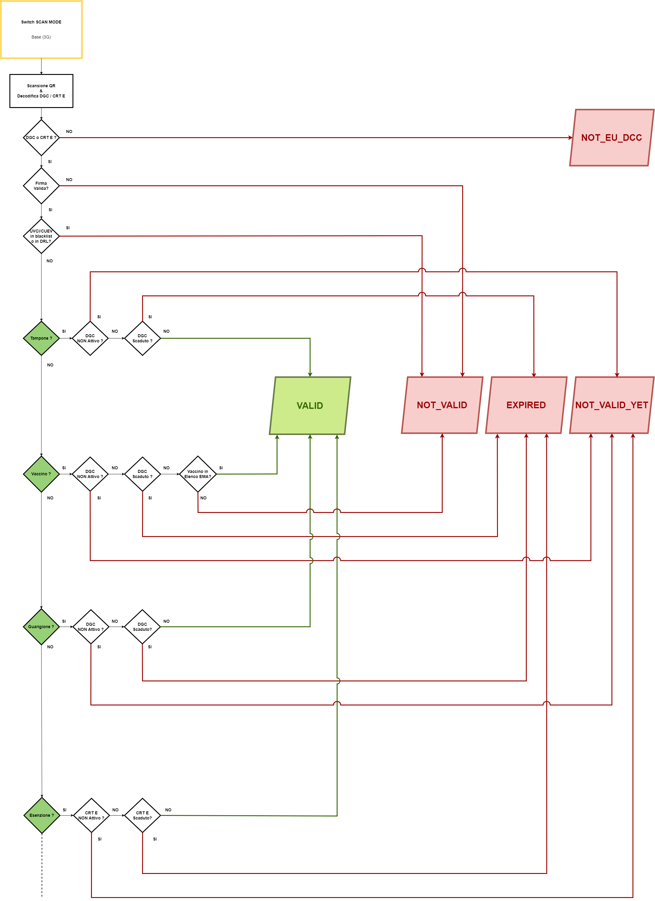

# ScanMode - Tipologie di verifica DGC

# Indice

- [Introduzione](#introduzione)
  - [Scopo del documento](#scopo-del-documento)
  - [Glossario](#glossario)
  - [Panoramica](#panoramica)
- [Scenari di Validazione](#scenari-di-validazione)
  - [Flusso Applicativo](#flusso-applicativo)
  - [Flussi Esenzione](#flussi-esenzione)
  - [Flussi Tampone](#flussi-tampone)
  - [Flussi Guarigione](#flussi-guarigione)
  - [Flussi Vaccinazione](#flussi-vaccinazione)
  - [Caso Limite](#caso-limite)  
- [Risorse SDK VerificaC19](#risorse-sdk-verificac19)
- [Note](#note)

# Introduzione

## Scopo del documento

Il presente documento si prefigge lo scopo di dettagliare i processi correlati alle tipologie di verifica Green Pass in Italia, onde agevolare gli sviluppatori terzi nell'adeguamento di librerie / applicazioni software per la gestione delle validazioni [[1]](#1).

Nelle sezioni successive sono pertanto riportati i tracciati dei flussi di validazione attualmente previsti, mostrando le logiche dei relativi controlli attraverso esempi di pseudocodice - basato sul codice [**SDK Android/Kotlin ufficiale VerificaC19**](https://github.com/ministero-salute/it-dgc-verificaC19-sdk-android).


## Glossario

Si riporta un breve elenco di alcuni acronimi e termini specifici utilizzati nel documento.

| Termine              | Descrizione                                                                                                                     |
| -------------------- | ------------------------------------------------------------------------------------------------------------------------------- |
| SDK                  | Software Development Kit                                                                                                        |
| DGC                  | Digital Green Certificate (in Italia conosciuto col nome di GreenPass)                                                          |
| DRL                  | DGC Revocation List                                                                                                             |
| Blacklist            | Lista di blocco                                                                                                                 |
| Validation Rules     | Regole nazionali di validazione dei GreenPass (tipologie certificati, durate, ..)                                               |
| UVCI                 | Unique Vaccination Certificate Identifier                                                                                       |
| CUEV                 | Codice Univoco Esenzione Vaccinale                                                                                              |
|                      |                                                                                                                                 |
| dn                   | Dose Number (Numero della dose somministrata)                                                                                   |
| sd                   | Total Series of Doses (Totale dosi del ciclo / ciclo + richiami)                                                                |
| mp                   | Medicinal Product (Codice prodotto vaccino)                                                                                     |
| co                   | Country of Vaccination/Test/Recovery (Nazione di vaccinazione/tampone/guarigione)                                               |
|                      |                                                                                                                                 |
| 3G                   | Verifica BASE (Vaccinazione / Guarigione / Tampone / Esenzione)                                                                 |
| 2G **(!)**           | Verifica RAFFORZATA (Vaccinazione / Guarigione / Esenzione)                                                                     |
| BOOSTER **(!)**      | Verifica VISITATORI RSA (Richiamo / Ciclo Completo + Tampone / Guarigione + Tampone / Esenzione + Tampone)                      |
| SCHOOL **(!)**       | Verifica STUDENTI (Richiamo / Ciclo Completo da meno di 120gg / Guarigione da meno di 120gg / Esenzione) **(!)**                |
| WORK **(!)**         | Verifica LAVORO (Vaccinazione / Guarigione / Tampone under 50 / Esenzione)                                                      |
| ENTRY_ITALY **(!)**  | Verifica INGRESSO IT (Richiamo / Ciclo completo da meno di 270gg (+ Tampone per NOT_EMA o più di 180gg) / Guarigione / Tampone) |
|                      |                                                                                                                                 |
| IT                   | Certificato emesso da Italia                                                                                                    |
| NOT_IT               | Certificato emesso da Stato estero                                                                                              |
| EMA                  | Medicinal Product in elenco autorizzati EMA (_incluso Sputnik solo SM - San Marino_)                                            |
| NOT_EMA              | Medicinal Product NON in elenco EMA                                                                                             |

> **(!)** _Da Febbraio 2022 l'utilizzo della Tipologia di verifica STUDENTI (scanmode SCHOOL) era consentito solo alle app ufficiali VerificaC19 per iOS e Android. Da Aprile 2022 tale tipologia di verifica è stata rimossa anche dalle app ufficiali._
>
> _Da Aprile 2022 è stato rimosso anche il supporto per la tipologia di verifica LAVORO (scanmode WORK)._
>
> _Da Giugno 2022 è stato rimosso anche il supporto per la tipologia di verifica INGRESSO IT (scanmode ENTRY_ITALY)._
>
> _Da Gennaio 2023 è stato rimosso anche il supporto per le tipologie di verifica VISITATORI RSA (scanmode BOOSTER) e RAFFORZATA (scanmode 2G)._
>
> _Pertanto tali modalità non devono essere più implementate all'interno degli SDK terzi (autorizzati dal Ministero della Salute in conformità al DPCM 12/10/2021)._

-------------------

##  Panoramica

Il processo di verifica GreenPass è sintetizzabile nella seguente sequenza di controlli :

1. Conformità a specifiche tecniche DGC di codifica e schema certificato.

2. Validità della firma del certificato.

3. Assenza del codice univoco UVCI (_vaccinazione / guarigione / tampone_) o CUEV (_esenzione_) del certificato nella [blacklist in Validation Rules](https://get.dgc.gov.it/v1/dgc/settings) e nella lista revoche in [DRL](DRL.md).

4. Validità in funzione dei criteri combinati di Validation Rules (tipologie DGC, durate) + Impostazione tipologia di verifica


Nel rispetto delle disposizioni normative e delle indicazioni fornite dagli Organi competenti, alla tipologia BASE (3G) di verifica dei DGC per Vaccinazione / Guarigione / Tampone sono state gradualmente aggiunte le tipologie RAFFORZATA (2G) - VISITATORI RSA - STUDENTI - LAVORO - INGRESSO IT [[2]](#2), che prevedono criteri addizionali per OK validazione.

Successivamente, in virtù delle disposizioni per il superamento delle misure di contrasto alla diffusione dell'epidemia da COVID-19 [[2b]](#2b), sono state rimosse le tipologie STUDENTI e LAVORO.

Dal 1 giugno 2022 la certificazione verde Covid-19 non è più necessaria per l'ingresso in Italia dai Paesi dell’Unione Europea e da Stati Terzi. Pertanto, è stata successivamente rimossa anche la tipologia INGRESSO IT.

Ne deriva la seguente tabella di riferimento per gli esiti di validazione in ambito di applicazione.

| Status        | Descrizione                                                                   | Semaforo | Note    |
| ------------- | ----------------------------------------------------------------------------- | -------- | ------- |
| NOT_EU_DCC    | Errore di lettura del QR Code, oppure non è il Certificato verde COVID-19     | ROSSO    |         |
| REVOKED       | Certificazione revocata                                                       | ROSSO    | **(1)** |
| EXPIRED       | Certificazione scaduta                                                        | ROSSO    | **(2)** |
| NOT_VALID_YET | Certificazione non ancora valida                                              | ROSSO    | **(2)** |
| NOT_VALID     | Certificazione non valida                                                     | ROSSO    |         |
|               |                                                                               |          |         |
| VALID         | Certificazione valida                                                         | VERDE    |         |

> _**Note :**_
>
> **(1)** _L'output dell'esito `REVOKED` è ammesso solo in ambito test/debug. In ambito produzione/release va invece utilizzato l'esito `NOT_VALID` qualora il KO validazione sia dovuto a presenza di UVCI/CUEV in blacklist/DRL._
>
> **(2)** _In ambito produzione/release è possibile utilizzare in alternativa l'esito generico `NOT_VALID`, qualora lo scenario internal in cui avvengano le validazioni non richieda di dettagliare i KO per inizio/fine validità dei certificati, consentendo quindi di minimizzare ulteriormente il trattamento dati in esito validazione a seguito di KO._


---------------

# Scenari di Validazione

## Flusso Applicativo

I vari scenari in ambito produzione/release con i rispettivi flussi di validazione DGC sono rappresentati nel seguente diagramma di flusso.



Nei paragrafi successivi vengono analizzati in dettaglio i flussi specifici & in funzione della tipologia DGC sottoposta a validazione.

-----------------

## Flussi Esenzione

Questa è la tabella degli esiti possibili per i nuovi certificati CRT E (esenzione) - fuori schema DGC.

| Tipologia | BASE              |
|-----------|-------------------|
| E         | VALID o NOT_VALID |

```
if  (EsitoVerificaBase(CRT-E) == VALID) {
        return CertificateStatus.VALID
    }
    else return CertificateStatus.NOT_VALID
```

---------------

## Flussi Tampone

Questa è la tabella degli esiti possibili per DGC T (tampone).

| Tipologia   | BASE              |
|-------------|-------------------|
| T (PCR/RAT) | VALID o NOT_VALID |

```
if  (EsitoVerificaBase(DGC-T) == VALID) {
        return CertificateStatus.VALID
    }
    else return CertificateStatus.NOT_VALID
```

----------------

## Flussi Guarigione

Questa è la tabella degli esiti possibili per DGC R (guarigione) e R-PV (guarigione post vaccino).


| Tipologia | Condizione                 | BASE             |
|-----------|----------------------------|------------------|
| R         | DGC IT                     | VALID o NOT_VALID|
| R         | DGC NOT_IT <180gg          | VALID o NOT_VALID|
| R         | DGC NOT_IT >=180gg **(!)** | VALID o NOT_VALID|
|           |                            |                  |
| R-PV      | DGC IT                     | VALID o NOT_VALID|

> **(!)** _Caso previsto nelle recenti disposizioni normative [[2]](#2), ma non riscontrabile in ambito produzione con le attuali [medicinal rules](https://get.dgc.gov.it/v1/dgc/settings). Queste prevedono infatti la medesima durata di 180gg sia per i certificati DCG R base di guarigione emessi in Italia che per quelli emessi da Stati esteri._

```
if  (EsitoVerificaBase(DGC-R) == VALID) {
        return CertificateStatus.VALID
    }
    else return CertificateStatus.NOT_VALID
```

Pertanto, anche in questo caso la gestione flussi in funzione della tipologia di verifica è comunque semplice.

Non vi è particolare complicazione di logica, sebbene contestualmente all'introduzione della verifica Booster (_rimossa da Gennaio 2023_) sia stato aggiunto anche il controllo per i **DGC R PV**, cioè i GreenPass di guarigione post-vaccinazione.

> Se si è contratta l’infezione Covid-19 oltre il quattordicesimo giorno dalla somministrazione della prima dose di vaccino oppure dopo il completamento del ciclo vaccinale primario oppure dopo la dose di richiamo (booster), la Certificazione è generata entro il giorno seguente l’emissione del certificato di guarigione.
>
> Questa nuova Certificazione verde COVID-19 per guarigione post vaccinazione `co = IT` è emessa a partire dal 28 dicembre 2021.

Per quanto riguarda la validazione in funzione della modalità impostata per tipologia di verifica, i DGC R PV vengono gestiti alla stregua dei DGC R base di guarigione `co = IT`.
Vengono riconosciuti / distinti da quelli base, onde validarli correttamente in virtù della diversa scadenza, tramite il controllo delle entry `extendedKeyUsage` e della corrispondenza del campo `co = IT` (_la diversa scadenza dei DGC R PV vale solo per quelli emessi in Italia_) :

| OID                         | DGC R                                          |
|-----------------------------|------------------------------------------------|
| 1.3.6.1.4.1.1847.2021.1.3   | Guarigione PV `co = IT` (540gg dal 07/02/2022) |
| 1.3.6.1.4.1.0.1847.2021.1.3 | Guarigione PV `co = IT` (540gg dal 07/02/2022) |

--------------

## Flussi Vaccinazione

Questa è la tabella degli esiti possibili per DGC V (vaccinazione).

| Tipologia | Condizione                      | BASE             |
|-----------|---------------------------------|------------------|
| V Parziale| EMA                             | VALID o NOT_VALID|
| V Parziale| NOT_EMA                         | NOT_VALID        |
|           |                                 |                  |
| V Ciclo   | EMA                             | VALID o NOT_VALID|
| V Ciclo   | NOT_EMA                         | NOT_VALID        |
|           |                                 |                  |
| V Richiamo| EMA                             | VALID o NOT_VALID|
| V Richiamo| NOT_EMA                         | NOT_VALID        |


Rispetto ai flussi dei casi Tampone e Guarigione vi è un controllo ulteriore di validazione, onde verificare se il prodotto vaccinale rientri o meno in elenco autorizzati EMA (_incluso Sputnik solo SM - San Marino_).

Non è invece più necessario distinguere le tipologie DGC V Parziale / Ciclo / Richiamo ai fini della validazione, dato che non influenza gli esiti di validazione in modalità di verifica Base.

------------------------

_**Nota :**_

Qualora si intenda comunque mantenere un controllo internal (_non necessario/richiesto ai fini di validazione n.d.r._) per la verifica tipologia DGC-V, queste sono le condizioni relative al rapporto dn/sd (_numero della dose somministrata / totale dosi_).

| dn/sd | DGC Vaccinazione                     |
|-------|--------------------------------------|
| < 1   | Vaccinazione Parziale                |
| > 1   | Vaccinazione Richiamo                |
| = 1   | _dipende.. servono altre condizioni_ |

La condizione dn=sd NON è ancora sufficiente, onde distinguere correttamente DGC V Ciclo Completo da DGC V Richiamo. Servono infatti due ulteriori condizioni relative a :

- Codice prodotto vaccinale (mp)

- Valore ordinale dello shot somministrato (dn) 

La prima (mp) consente infatti di distinguere tra le vaccinazioni con ciclo base 2 dosi e quelle con ciclo monodose. In tal senso la condizione è agevole da implementare, essendovi un solo Medicinal Product monodose definito nelle Validation Rules = EU/1/20/1525 Jannsen - in Italia più noto con il nome Johnson&Johnson.

Unitamente alla seconda condizione (dn) è possibile definire la seguente tabella di riferimento per i controlli internal - secondo le regole di standardizzazione delle codifiche dn/sd per i DGC-V, approvate in data 21 Dicembre 2021 & effettive dal 1 Febbraio 2022 [[3]](#3). 

| dn/sd | Medicinal Product    | Vaccinazione   |
|-------|----------------------|----------------|
| 1/1   | JOHNSON              | Ciclo Completo |
|       |                      |                |
| 1/2   | any                  | Parziale       |
|       |                      |                |
| 2/1   | any                  | Booster        |
| 2/2   | JOHNSON              | Booster        |
| 2/2   | any tranne JOHNSON   | Ciclo Completo |
|       |                      |                |
| 3/1   | any                  | Booster        |
| 3/2   | any                  | Booster        |
| 3/3   | any                  | Booster        |
|       |                      |                |
| 4/1   | any                  | Booster        |
| 4/4   | any                  | Booster        |


----------------------

Questo è quindi l'attuale flusso di controllo per i certificati DGC-V.

```
if (dn < sd) TipologiaVaccino = "PARZIALE"
if (dn > sd) TipologiaVaccino = "RICHIAMO"

if (dn == sd) {
    if (((MedicinalProduct == JOHNSON) AND (dn >=2))
        OR ((MedicinalProduct != JOHNSON) AND (dn >=3))
    ) TipologiaVaccino = "RICHIAMO"
    else TipologiaVaccino = "CICLO"
}

if (CertificatoScaduto == VERO) return CertificateStatus.EXPIRED
if (CertificatoNonAttivo == VERO) return CertificateStatus.NOT_VALID_YET

if (VaccinoEMA == FALSO) {
    return CertificateStatus.NOT_VALID
}

if (EsitoVerificaBase(DGC-V) == VALID) {
    return CertificateStatus.VALID
}
else return CertificateStatus.NOT_VALID
```

------------------------

## Risorse SDK VerificaC19

- [SDK/Librerie terze - autorizzate da Ministero della Salute](https://github.com/ministero-salute/it-dgc-verificac19-sdk-onboarding#lista-librerie)

- [SDK Android/Kotlin ufficiale](https://github.com/ministero-salute/it-dgc-verificac19-sdk-android/blob/develop/README.md)

- [Documentazione dettagliata SDK Android/Kotlin](https://ministero-salute.github.io/it-dgc-verificac19-sdk-android/documentation/)

- [Documentazione Digital Green Certificate Revocation List (DRL)](DRL.md)

- [Documentazione Certificati Digitali di Esenzione Vaccinale](EXEMPTIONS.md)


------------------------

## Note

#### [1]
- Repository di SDK/librerie per validazione GreenPass - sviluppate da terze parti in ottemperanza ai commi 12 e 13 del DPCM 12 ottobre 2021 & approvate del Ministero della Salute - [**VerificaC19 SDK Onboarding**](https://github.com/ministero-salute/it-dgc-verificac19-sdk-onboarding)

#### [2]
- Disposizioni normative di aggiunta Tipologia Verifica Rafforzata - [Art.5 DL 172/2021 26/11/2021](https://www.trovanorme.salute.gov.it/norme/dettaglioAtto?id=84133&articolo=5)
- Disposizioni Normative di aggiunta Tipologia Verifica Visitatori RSA - [Art.7 DL 221/2021 24/12/2021](https://www.trovanorme.salute.gov.it/norme/dettaglioAtto?id=84682&articolo=7)
- Disposizioni Normative di aggiunta Tipologia Verifica Studenti - [Art.4 DL 1/2022 07/01/2002](https://www.trovanorme.salute.gov.it/norme/dettaglioAtto?id=84933&articolo=4)
- Disposizioni Normative di aggiunta Tipologia Verifica Lavoro - [Art.1 DL 1/2022 07/01/2022](https://www.trovanorme.salute.gov.it/norme/dettaglioAtto?id=84933&articolo=1)
- Disposizioni Normative di aggiunta Tipologia Verifica Ingresso IT - [Art.3 DL 5/2022 04/02/2022](https://www.trovanorme.salute.gov.it/norme/dettaglioAtto?id=85657&articolo=3)

#### [2b]
- Disposizioni normative per il superamento delle misure di contrasto alla diffusione dell'epidemia da COVID-19 - [DL 24/2022 24/03/2022](https://www.trovanorme.salute.gov.it/norme/dettaglioAtto?id=86394)

#### [3]
- [Comunicato nuove regole DGC approvate da Commissione UE](https://ec.europa.eu/commission/presscorner/detail/en/ip_21_6837)
- [Specifiche tecniche - codifiche standard dn/sd per DGC V Richiamo](https://ec.europa.eu/info/sites/default/files/technical_specifications_act_and_annex.pdf)
