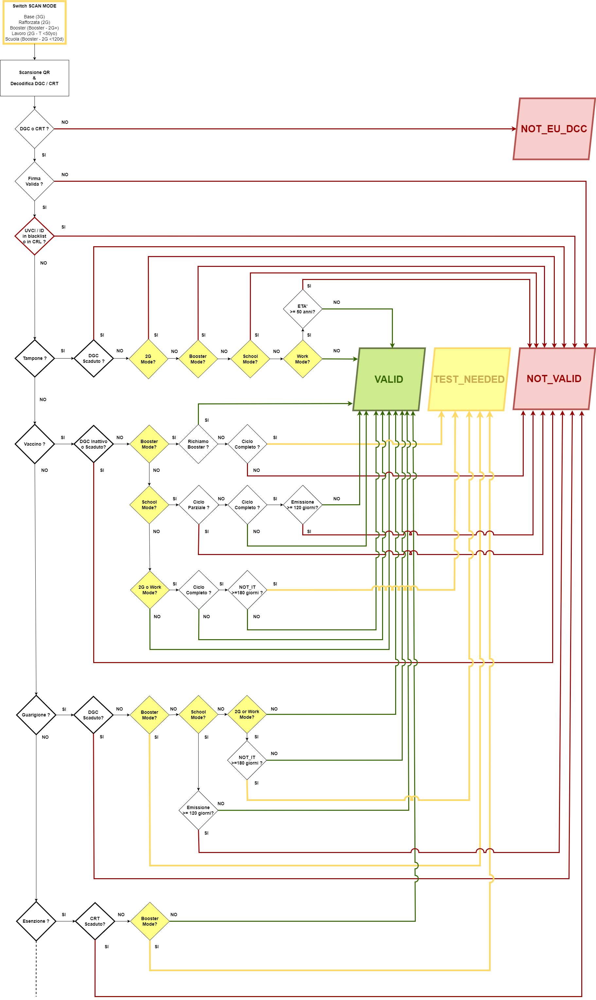
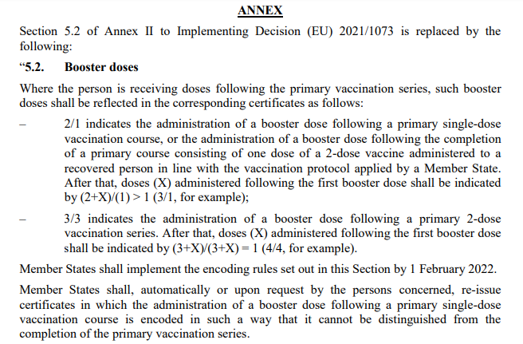

# ScanMode - Tipologie di verifica DGC

# Indice

- [Introduzione](#introduzione)
  - [Scopo del documento](#scopo-del-documento)
  - [Glossario](#glossario)
  - [Panoramica](#panoramica)
- [Scenari di Validazione](#scenari-di-validazione)
  - [Flusso Applicativo](#flusso-applicativo)
  - [Flussi Esenzione](#flussi-esenzione)
  - [Flussi Tampone](#flussi-tampone)
  - [Flussi Guarigione](#flussi-guarigione)
  - [Flussi Vaccinazione](#flussi-vaccinazione)
  - [Caso Limite](#caso-limite)  
- [Risorse SDK VerificaC19](#risorse-sdk-verificac19)
- [Note](#note)

# Introduzione

## Scopo del documento

Il presente documento si prefigge lo scopo di dettagliare i processi correlati alle tipologie di verifica Green Pass in Italia, onde agevolare gli sviluppatori terzi nell'adeguamento di librerie / applicazioni software per la gestione delle validazioni [[1]](#1).

Nelle sezioni successive sono pertanto riportati i tracciati dei flussi di validazione attualmente previsti, mostrando le logiche dei relativi controlli attraverso esempi di pseudocodice - basato sul codice [**SDK Android/Kotlin ufficiale VerificaC19**](https://github.com/ministero-salute/it-dgc-verificaC19-sdk-android).


## Glossario

Si riporta un breve elenco di alcuni acronimi e termini specifici utilizzati nel documento.

| Termine              | Descrizione                                                                                           |
| -------------------- | ----------------------------------------------------------------------------------------------------- |
| SDK                  | Software Development Kit                                                                              |
| DGC                  | Digital Green Certificate (in Italia conosciuto col nome di GreenPass)                                |
| DRL                  | DGC Revocation List                                                                                   |
| Blacklist            | Lista di blocco                                                                                       |
| Validation Rules     | Regole nazionali di validazione dei GreenPass (tipologie certificati, durate, ..)                     |
| UVCI                 | Unique Vaccination Certificate Identifier                                                             |
| dn                   | Dose Number (Numero della dose somministrata)                                                         |
| sd                   | Total Series of Doses (Totale dosi del ciclo / ciclo + richiami)                                      |
| mp                   | Medicinal Product (Codice prodotto vaccino)                                                           |
| co                   | Country of Vaccination/Test/Recovery (Nazione di vaccinazione/tampone/guarigione)                     |
| 3G                   | Verifica BASE (Vaccinazione / Guarigione / Tampone / Esenzione)                                       |
| 2G                   | Verifica RAFFORZATA (Vaccinazione / Guarigione / Esenzione)                                           |
| BOOSTER              | Verifica BOOSTER (Richiamo / Ciclo Completo + Tampone / Guarigione + Tampone / Esenzione + Tampone)   |
| WORK                 | Verifica LAVORO (Vaccinazione / Guarigione / Tampone under 50 / Esenzione)                            |
| SCHOOL               | Verifica SCUOLA (Richiamo / Ciclo Completo da meno di 120gg / Guarigione da meno di 120gg / Esenzione |
| IT                   | Certificato emesso da Italia                                                                          |
| NOT_IT               | Certificato emesso da Stato estero                                                                    |

##  Panoramica

Il processo di verifica GreenPass è sintetizzabile nella seguente sequenza di controlli :

1. Conformità a specifiche tecniche DGC di codifica e schema certificato.

2. Validità della firma del certificato.

3. Assenza dell'UVCI nella [blacklist in Validation Rules](https://get.dgc.gov.it/v1/dgc/settings) e nella lista revoche in [DRL](DRL.md).

4. Validità in funzione dei criteri combinati di Validation Rules (tipologie DGC, durate) + Impostazione tipologia di verifica


Nel rispetto delle disposizioni normative e delle indicazioni fornite dagli Organi competenti, alla tipologia BASE (3G) di verifica dei DGC per Vaccinazione / Guarigione / Tampone sono state aggiunte le tipologie RAFFORZATA (2G) - BOOSTER - LAVORO - SCUOLA [[2]](#2), che prevedono criteri addizionali per OK validazione.

Ne deriva la seguente tabella di riferimento per gli esiti di validazione in ambito di applicazione.

| Status      | Descrizione                                                                   | Semaforo |
| ----------- | ----------------------------------------------------------------------------- | -------- |
| NOT_EU_DCC  | Errore di lettura del QR Code, oppure non è il Certificato verde COVID-19     | ROSSO    |
| NOT_VALID   | Certificazione non valida                                                     | ROSSO    |
| TEST_NEEDED | Certificazione valida richiesto tampone                                       | GIALLO   |
| VALID       | Certificazione valida                                                         | VERDE    |

> _**Nota :**_ 
>
> _Ancora ammessa la possibilità di restituire - pure in ambito produzione/release - l'esito `NOT_VALID_YET` **'Certificazione ancora non valida'**, qualora il KO validazione sia dovuto a controllo effettuato in data anteriore alla data d'inizio validità del certificato - definita nelle [Validation Rules](https://get.dgc.gov.it/v1/dgc/settings)._
>
> _Trattandosi comunque di un sottocaso di `NOT_VALID`, nei paragrafi successivi non verrà esplicitato._


---------------

# Scenari di Validazione

## Flusso Applicativo

I vari scenari con i rispettivi flussi di validazione DGC sono rappresentati nel seguente diagramma di flusso.



Nei paragrafi successivi vengono analizzati in dettaglio i flussi specifici & in funzione della tipologia DGC sottoposta a validazione.

## Flussi Esenzione

Questa è la tabella degli esiti possibili per i nuovi certificati CRT E (esenzione) - fuori schema DGC.

| Tipologia | BASE              | RAFFORZATA        | BOOSTER                 | LAVORO            | SCUOLA            | 
|-----------|-------------------|-------------------|-------------------------|-------------------|-------------------|
| E (any)   | VALID o NOT_VALID | VALID o NOT_VALID | TEST_NEEDED o NOT_VALID | VALID o NOT_VALID | VALID o NOT_VALID |

Solo l'impostazione della tipologia di verifica Booster comporta override di esito rispetto alla tipologia di verifica Base.

```
if  (EsitoVerificaBase(CRT-E) == VALID) {
        if (TipologiaVerifica == "BOOSTER") return CertificateStatus.TEST_NEEDED
            else return CertificateStatus.VALID
    }
    else return CertificateStatus.NOT_VALID
```

## Flussi Tampone

Questa è la tabella degli esiti possibili per DGC T (tampone).

| Tipologia | Condizione    | BASE              | RAFFORZATA | BOOSTER     | LAVORO            | SCUOLA    | 
|-----------|---------------|-------------------|------------|-------------|-------------------|-----------|
| T (any)   | Età < 50 anni | VALID o NOT_VALID | NOT_VALID  | NOT_VALID   | VALID o NOT_VALID | NOT_VALID |
| T (any)   | Età >=50 anni | VALID o NOT_VALID | NOT_VALID  | NOT_VALID   | NOT_VALID         | NOT_VALID |

La sola impostazione della tipologia di verifica Rafforzata (2G) o Booster o Scuola comporta infatti automaticamente l'esito di certificazione non valida. 

```
if ((TipologiaVerifica == "BOOSTER") OR (TipologiaVerifica == "RAFFORZATA") OR (TipologiaVerifica == "SCUOLA")) return CertificateStatus.NOT_VALID
    else {
          if ((TipologiaVerifica == "LAVORO") AND (età >= 50)) return CertificateStatus.NOT_VALID
             else return CertificateStatus.EsitoVerificaBase(DGC-T)
    }
```

## Flussi Guarigione

Questa è la tabella degli esiti possibili per DGC R (guarigione).


| Tipologia | Condizione                            | BASE              | RAFFORZATA              | BOOSTER                 | LAVORO                  | SCUOLA            | 
|-----------|---------------------------------------|-------------------|-------------------------|-------------------------|-------------------------|-------------------|
| R / R-PV  | DGC Attivo da <120gg                  | VALID o NOT_VALID | VALID o NOT_VALID       | TEST_NEEDED o NOT_VALID | VALID o NOT_VALID       | VALID o NOT_VALID |
| R / R-PV  | DGC IT Attivo da >=120gg              | VALID o NOT_VALID | VALID o NOT_VALID       | TEST_NEEDED o NOT_VALID | VALID o NOT_VALID       | NOT_VALID         |
| R / R-PV  | DGC NOT_IT Attivo da >=120gg & <180gg | VALID o NOT_VALID | VALID o NOT_VALID       | TEST_NEEDED o NOT_VALID | VALID o NOT_VALID       | NOT_VALID         |
| R / R-PV  | DGC NOT_IT Attivo da >=180gg          | VALID o NOT_VALID | TEST_NEEDED o NOT_VALID | TEST_NEEDED o NOT_VALID | TEST_NEEDED o NOT_VALID | NOT_VALID         |

Questo è quindi il relativo flusso con gli override di esito rispetto alla tipologia di verifica Base, in funzione di scanmode / durata / Stato di emissione.

```
if  (EsitoVerificaBase(DGC-R) == VALID) {
        if (TipologiaVerifica == "BOOSTER") return CertificateStatus.TEST_NEEDED
            else {
                  if ((TipologiaVerifica == "SCUOLA") AND (Attivo >= 120)) return CertificateStatus.NOT_VALID
			          else {
					        if (
					            ((TipologiaVerifica == "RAFFORZATA") OR (TipologiaVerifica == "LAVORO"))
					            AND
							    ((NazioneCertificato == "NOT_IT") AND (Attivo >= 180))
                                ) return CertificateStatus.TEST_NEEDED
								     else return CertificateStatus.VALID
                      }
            }
    }
    else return CertificateStatus.NOT_VALID
```

Pertanto, anche in questo caso la gestione flussi in funzione della tipologia di verifica è alquanto semplice.

Non vi è differenziazione di logica, sebbene contestualmente all'introduzione della verifica Booster sia stato aggiunto anche il controllo per i **DGC R PV**, cioè i GreenPass di guarigione post-vaccinazione.

> se si è contratta l’infezione Covid-19 oltre il quattordicesimo giorno dalla somministrazione della prima dose di vaccino oppure dopo il completamento del ciclo vaccinale primario oppure dopo la dose di richiamo (booster), la Certificazione è generata entro il giorno seguente l’emissione del certificato di guarigione.
>
> Questa nuova Certificazione verde COVID-19 per guarigione post vaccinazione, valida per 9 mesi dalla data del certificato di guarigione, verrà emessa a partire dal 28 dicembre 2021.

Per quanto riguarda la validazione in funzione della modalità impostata per tipologia di verifica, i DGC R PV vengono gestiti alla stregua dei DGC base di guarigione con durata 180gg.

Vengono semplicemente riconosciuti / distinti da quelli base, onde validarli correttamente in virtù della diversa scadenza, tramite il controllo delle entry `extendedKeyUsage` e della corrispondenza del campo CO = IT (_la diversa scadenza dei DGC R PV vale solo quelli emessi in Italia_) :

| OID                         | DGC R                                                     | 
|-----------------------------|-----------------------------------------------------------|
| 1.3.6.1.4.1.1847.2021.1.3   | Guarigione 180gg                                          | 
| 1.3.6.1.4.1.0.1847.2021.1.3 | Guarigione PV CO=IT 270gg (da 01/02/2022 ridotta a 180gg) |

## Flussi Vaccinazione

Questa è la tabella degli esiti possibili per DGC V (vaccinazione).

| Tipologia        | Condizione                            | BASE              | RAFFORZATA               | BOOSTER                 | LAVORO                  | SCUOLA            |
|------------------|---------------------------------------|-------------------|--------------------------|-------------------------|-------------------------|-------------------|
| V Parziale       | any                                   | VALID o NOT_VALID | VALID o NOT_VALID        | NOT_VALID               | VALID o NOT_VALID       | NOT_VALID         |
| V Ciclo Completo | DGC Attivo da  <120gg                 | VALID o NOT_VALID | VALID o NOT_VALID        | TEST_NEEDED o NOT_VALID | VALID o NOT_VALID       | VALID o NOT_VALID |
| V Ciclo Completo | DGC IT Attivo da >=120gg              | VALID o NOT_VALID | VALID o NOT_VALID        | TEST_NEEDED o NOT_VALID | VALID o NOT_VALID       | NOT_VALID         |
| V Ciclo Completo | DGC NOT_IT Attivo da >=120gg & <180gg | VALID o NOT_VALID | VALID o NOT_VALID        | TEST_NEEDED o NOT_VALID | VALID o NOT_VALID       | NOT_VALID         |
| V Ciclo Completo | DGC NOT_IT Attivo da >=180gg          | VALID o NOT_VALID | TEST_NEEDED o NOT_VALID  | TEST_NEEDED o NOT_VALID | TEST_NEEDED o NOT_VALID | NOT_VALID         |
| V Richiamo       | any                                   | VALID o NOT_VALID | VALID o NOT_VALID        | VALID o NOT_VALID       | VALID o NOT_VALID       | VALID o NOT_VALID |

Rispetto ai flussi dei casi Tampone e Guarigione è evidente una maggior complessità di gestione per tipologia DGC V parziale / ciclo completo / richiamo.

Pertanto, è necessario definire le condizioni per distinguere le tipologie DGC V. In primis si procede, controllando il valore del rapporto dn/sd.

| dn/sd | DGC Vaccinazione                     |
|-------|--------------------------------------|
| < 1   | Vaccinazione Parziale                |
| > 1   | Vaccinazione Richiamo                |
| = 1   | _dipende.. servono altre condizioni_ |

La condizione dn=sd NON è ancora sufficiente, onde distinguere correttamente DGC V Ciclo Completo da DGC V Richiamo. Servono infatti due ulteriori condizioni relative a :

- Codice prodotto vaccinale (mp)

- Valore ordinale dello shot somministrato (dn) 

La prima (mp) consente infatti di distinguere tra le vaccinazioni con ciclo base 2 dosi e quelle con ciclo monodose. In tal senso la condizione è agevole da implementare, essendovi un solo Medicinal Product monodose definito nelle Validation Rules = EU/1/20/1525 Jannsen - in Italia più noto con il nome Johnson&Johnson.

Unitamente alla seconda condizione (dn) è possibile definire una tabella di riferimento per gli override esiti di DGC V, che ottengano esito Valid in condizioni di verifica Base.

| dn/sd | Medicinal Product    | Vaccinazione   | BOOSTER        | SCUOLA                | RAFFORZATA / LAVORO           | 
|-------|----------------------|----------------|----------------|-----------------------|-------------------------------|
| 1/1   | JOHNSON              | Ciclo Completo | TEST_NEEDED    | VALID (<120gg)        | VALID                         |
|       |                      |                |                | o NOT_VALID (>=120gg) |                               |
| 1/2   | any                  | Parziale       | NOT_VALID      | NOT_VALID             | VALID                         |
| 2/1   | any                  | Booster        | VALID          | VALID                 | VALID                         |
| 2/2   | JOHNSON              | Booster        | VALID          | VALID                 | VALID                         |
| 2/2   | any tranne JOHNSON   | Ciclo Completo | TEST_NEEDED    | VALID (<120gg)        | VALID (IT / NOT_IT<180gg)     |
|       |                      |                |                | o NOT_VALID (>=120gg) | o TEST_NEEDED (NOT_IT>=180gg) |
| 3/2   | any                  | Booster        | VALID          | VALID                 | VALID                         |
| 3/3   | any                  | Booster        | VALID          | VALID                 | VALID                         |

In base a questa tabella è possibile ricavare le condizioni di controllo, onde distinguere in modo preciso le tipologie DGC V nelle tipologie di verifica.

```
if  (EsitoVerificaBase(DGC-V) == VALID) {
        if ((TipologiaVerifica == "BOOSTER") OR (TipologiaVerifica == "SCUOLA")) {
            if (dn >= sd) {
                if (MedicinalProduct == JOHNSON) {
                    if ((dn == sd) AND (dn < 2) AND (TipologiaVerifica == "BOOSTER")) return CertificateStatus.TEST_NEEDED
                    if ((dn == sd) AND (dn < 2) AND (TipologiaVerifica == "SCUOLA") AND (Attivo >= 120)) return CertificateStatus.NOT_VALID
                } else {
                    if ((dn == sd) AND (dn < 3) AND (TipologiaVerifica == "BOOSTER")) return CertificateStatus.TEST_NEEDED // check altri mp
                    if ((dn == sd) AND (dn < 3) AND (TipologiaVerifica == "SCUOLA") AND (Attivo >= 120)) return CertificateStatus.NOT_VALID
                }
                return CertificateStatus.VALID
            }
            else return CertificateStatus.NOT_VALID // dn<sd comporta NOT_VALID in Verifica Booster e Scuola
        }
        else if ((TipologiaVerifica == "LAVORO") OR (TipologiaVerifica == "RAFFORZATA")) {
                if ((NazioneCertificato == "NOT_IT") AND (Attivo >= 180)) {
                    if ((MedicinalProduct == JOHNSON) {
						if ((dn == sd) AND (dn < 2) return CertificateStatus.TEST_NEEDED
                    } else {
						if ((dn == sd) AND (dn < 3) return CertificateStatus.TEST_NEEDED // check altri mp
                    }
                    return CertificateStatus.VALID
                } else return CertificateStatus.VALID
		}
		return CertificateStatus.VALID 
    }
    else return CertificateStatus.NOT_VALID
```

Tale combinazione di condizioni di controllo consente quindi di validare correttamente tutte le combinazioni dn/sd - mp per DGC V... tranne una = **caso limite**.

## Caso Limite

Vi è effettivamente un caso di DGC-V che non viene riconosciuto correttamente in tipologia di verifica Booster. Nello specifico si tratta del **DGC V emesso a seguito di richiamo eterologo post 1° dose Johnson & con codifica dn/sd 2/2**.

| **Booster cross-vaccination DGC 2/2 with 1st shot JOHNSON & 2nd shot other medicinal product** |
|------------------------------------------------------------------------------------------------|

Tale DGC NON è infatti distinguibile da un DGC V Ciclo Completo 2/2 per il medesimo Medicinal Product, dato che lo schema DGC non include informazioni sul medicinal product della somministrazione precedente. 

Ciò si traduce in un esito TEST_NEEDED invece di VALID - che sarebbe quello corretto per questo caso.

Questo caso limite è l'effetto di una mancata standardizzazione delle codifiche dn/sd per i DGC V Richiamo, per cui tra Novembre e Dicembre 2021 più Stati UE hanno usato anche la codifica 2/2 (_e non 2/1 e/o 3/3_) per questa tipologia di DGC V Richiamo eterologo.

Il riscontro di caso limite non riguarda infatti solo l'Italia, ma p.es. anche la Danimarca e soprattutto la Germania, avendo adottato per i richiami lo stesso schema dn=sd usato per i propri DGC V Ciclo omologo/eterologo [[3]](#3).

Per questo motivo, non essendo una casistica risolvibile dalle piattaforme di validazione DGC, la commissione UE ha inserito anche la standardizzazione delle codifiche dn/sd per i DGC V Richiamo nel novero di nuove regole per i DGC, approvate in data 21 Dicembre 2021 [[4]](#4). 

Le nuove regole saranno pienamente effettive dal 1 Febbraio 2022:

| dn/sd   | Ambito di applicazione                                                                                         |
|---------|----------------------------------------------------------------------------------------------------------------|
| **3/3** | Richiami a seguito di ciclo vaccinale completo con 2 dosi                                                      |
| **2/1** | Richiami a seguito di ciclo monodose (Johnson & Johnson) o di somministrazione unica 2 dosi a soggetto guarito |


Inoltre, gli Stati membri devono anche predisporre le procedure per revoca dei DGC V Richiamo eterologo con codifica 2/2 & emissione nuovi DGC V con nuova codifica standard.



Per quanto concerne l'Italia, il Ministero della Salute sta procedendo con le riemissioni dei DGC non conformi alle nuove regole, come risulta anche da segnalazioni pubbliche di utenti, che hanno già potuto scaricare i loro nuovi DGC tramite l'app Io.

Infatti, è già stata inserita tra le [FAQ DGC](https://www.dgc.gov.it/web/faq.html) la nota di completamento emissioni dei nuovi DGC V Richiamo dn/sd 2/1 per tutti coloro, che avevano ricevuto il richiamo dopo vaccino Janseen (J&J) tra l'11 novembre e il 22 dicembre 2021. 

------------------------

## Risorse SDK VerificaC19

- [SDK/Librerie terze - autorizzate da Ministero della Salute](https://github.com/ministero-salute/it-dgc-verificac19-sdk-onboarding#lista-librerie)

- [SDK Android/Kotlin ufficiale](https://github.com/ministero-salute/it-dgc-verificac19-sdk-android/blob/develop/README.md)

- [Documentazione dettagliata SDK Android/Kotlin](https://ministero-salute.github.io/it-dgc-verificac19-sdk-android/documentation/)

- [Documentazione Digital Green Certificate Revocation List (DRL)](DRL.md)

- [Documentazione Certificati Digitali di Esenzione Vaccinale](EXEMPTIONS.md)


------------------------

## Note

#### [1]
- Repository di SDK/librerie per validazione GreenPass - sviluppate da terze parti in ottemperanza ai commi 12 e 13 del DPCM 12 ottobre 2021 & approvate del Ministero della Salute - [**VerificaC19 SDK Onboarding**](https://github.com/ministero-salute/it-dgc-verificac19-sdk-onboarding)

#### [2]
- Disposizioni normative di aggiunta Tipologia Verifica Rafforzata - [Art.5 DL 172/2021 26/11/2021](https://www.trovanorme.salute.gov.it/norme/dettaglioAtto?id=84133&articolo=5)
- Disposizioni Normative di aggiunta Tipologia Verifica Booster - [Art.7 DL 221/2021 24/12/2021](https://www.trovanorme.salute.gov.it/norme/dettaglioAtto?id=84682&articolo=7)
- Disposizioni Normative di aggiunta Tipologia Verifica Lavoro - [Art.1 DL 1/2022 07/01/2022](https://www.trovanorme.salute.gov.it/norme/dettaglioAtto?id=84933&articolo=1)
- Disposizioni Normative di aggiunta Tipologia Verifica Scuola - [Art.4 DL 1/2022 07/01/2002](https://www.trovanorme.salute.gov.it/norme/dettaglioAtto?id=84933&articolo=4)

#### [3]
- FAQ verifier-app CovPass Germania - [Why is the certificate for my booster vaccination invalid or not immediately valid?](https://www.digitaler-impfnachweis-app.de/en/faq)

#### [4]
- [Comunicato nuove regole DGC approvate da Commissione UE](https://ec.europa.eu/commission/presscorner/detail/en/ip_21_6837)
- [Specifiche tecniche - codifiche standard dn/sd per DGC V Richiamo](https://ec.europa.eu/info/sites/default/files/technical_specifications_act_and_annex.pdf)
